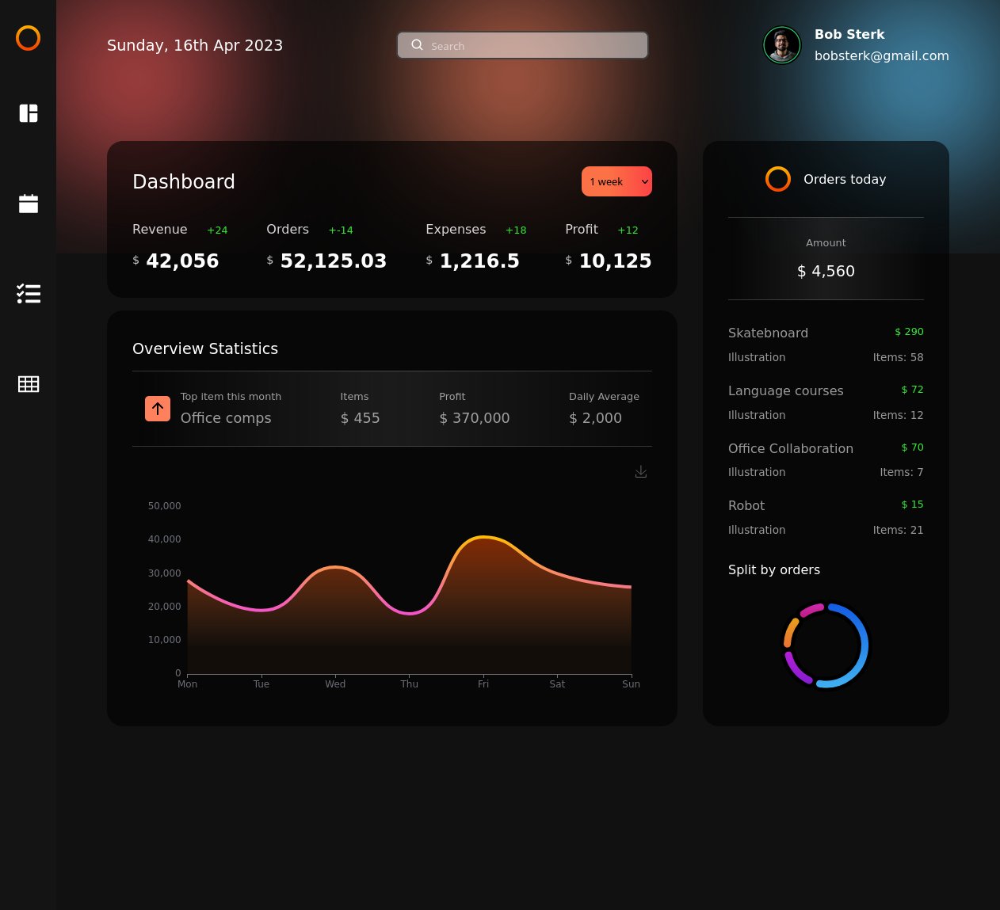
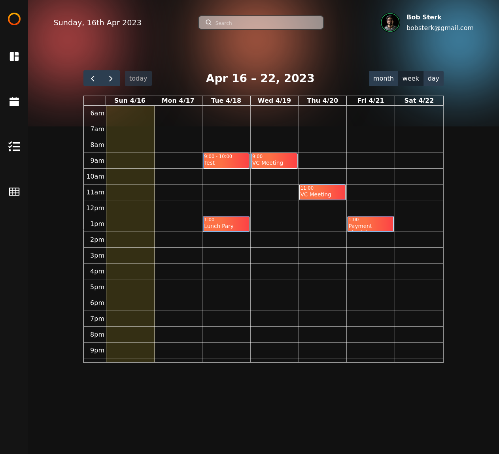
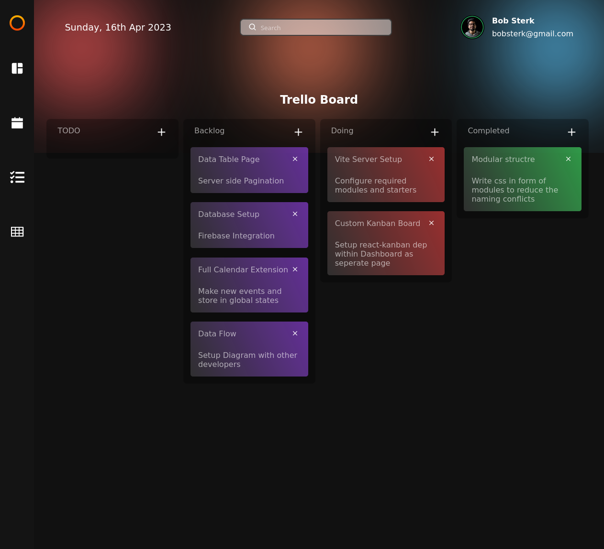
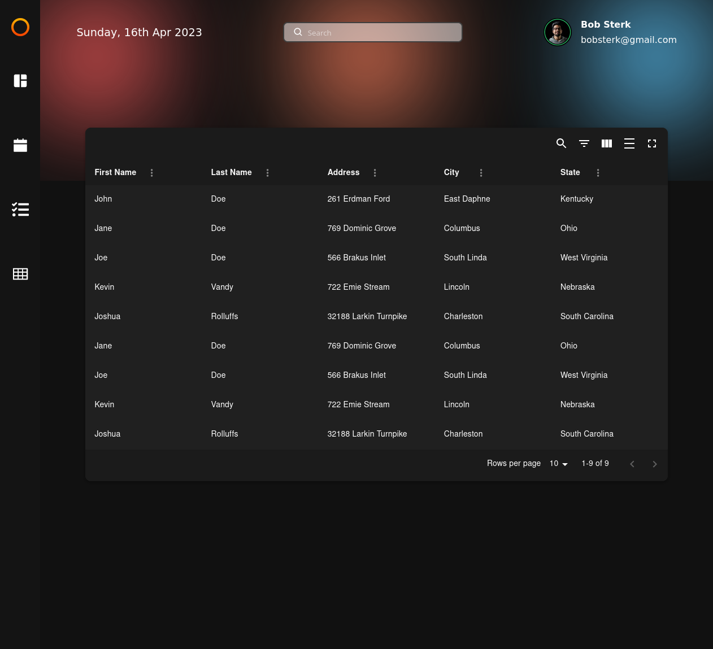

# Admin Dashboard

Admin Dashboard in web application made to training purpose.

Exceptions:

- Desktop Only
- Data provided from file

## Tech Stack and Libraries

- React
- CSS
- JS
- Zustand
- React Router
- moment.js
- FullCalendar
- Kanban
- echarts
- react-table
- react-icons

## Live

https://jc-admin-dashboard.netlify.app

## Features

- [Dashboard](#Dashboard)
- [Calendar](#Calendar)
- [Trello Board](#Trello-Board)
- [User Board](#User-Board)

### Dashboard

Displaying provided data via maping and echart library.

### Calendar

Displaying calendar events and handling(adding, removing) them with FullCallendar library.

### Trello Board

Trello board using react-kanban library. Functionality possible of moving whole column and taskts betwen columns.

### User Board

User tabels provided from material UI library with Functionality search, sorting by, exclude column etc.

